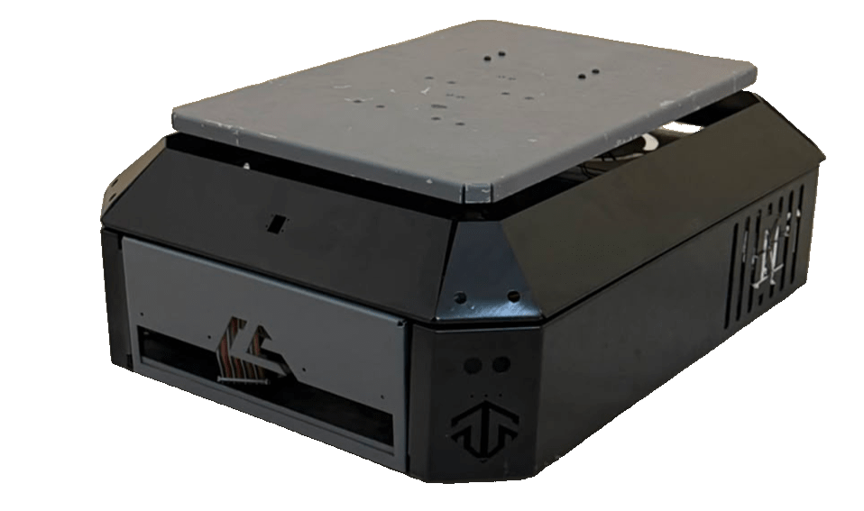
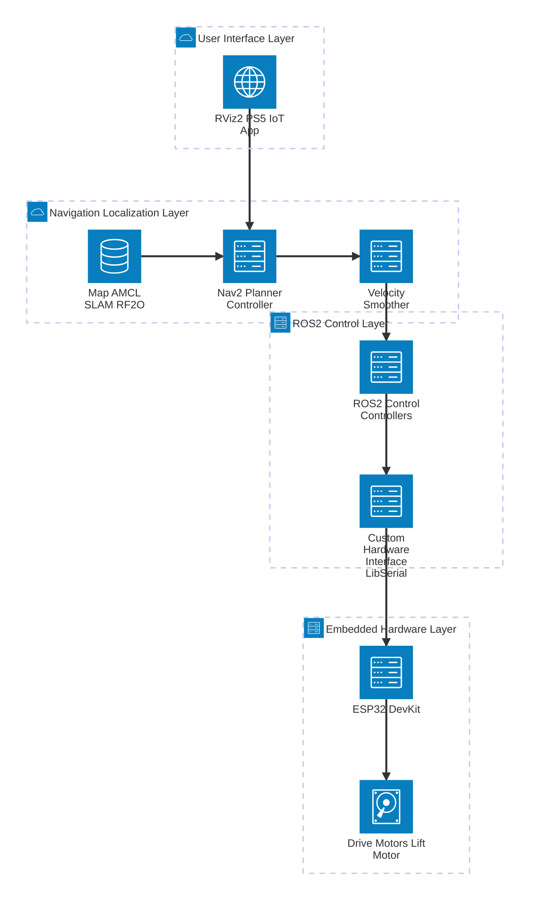

# Logistic Autonomous Robot

> A ROS 2 Humble autonomous logistics robot built for indoor navigation, station approach, cargo lifting, and future IoT / vision-assisted operation.

<p align="center">
  
  
</p>

<p align="center">
  <b>Demo Video:</b> <a href="docs/videos/navigation_demo.mp4">Navigation Test</a> |
  <b>Demo Video:</b> <a href="docs/videos/station_demo.mp4">Station / Lift Test</a> |
  <b>Demo Video:</b> <a href="docs/videos/mapping_demo.mp4">Mapping Test</a>
</p>

> Replace the image and video paths above with your real robot photos and demo videos after uploading them to the repository.

---

## Table of Contents

- [Project Overview](#project-overview)
- [Main Features](#main-features)
- [System Architecture](#system-architecture)
- [Hardware](#hardware)
- [Software Stack](#software-stack)
- [Repository Structure](#repository-structure)
- [ROS 2 Packages](#ros-2-packages)
- [Coordinate Frames and TF Tree](#coordinate-frames-and-tf-tree)
- [Serial Communication Protocol](#serial-communication-protocol)
- [Navigation and Localization](#navigation-and-localization)
- [Manual Engineering Edits](#manual-engineering-edits)
- [Installation](#installation)
- [Building the Workspace](#building-the-workspace)
- [Running the Robot](#running-the-robot)
- [Testing Checklist](#testing-checklist)
- [Troubleshooting](#troubleshooting)
- [Advantages of the Project](#advantages-of-the-project)
- [Roadmap](#roadmap)
- [Safety Notes](#safety-notes)
- [License](#license)

---

## Project Overview

This project is a complete ROS 2 mobile robot system designed for logistics-style operation. The robot is intended to:

1. Build or use a 2D map of an indoor environment.
2. Localize itself using LiDAR odometry and AMCL / EKF localization.
3. Navigate to target points using Nav2.
4. Approach loading / unloading stations.
5. Control a NEMA-driven lifting mechanism through an ESP32.
6. Support future camera-based station alignment and IoT command integration.

The robot was developed around a real physical platform, not only simulation. Because of that, the project includes several hardware-specific solutions such as custom `ros2_control` hardware interfaces, ESP32 serial control, LD06 LiDAR configuration, RF2O laser odometry, and conservative Nav2 tuning for a mechanically challenging differential-drive base.

---

## Main Features

- ROS 2 Humble workspace for a real mobile robot.
- Custom URDF / Xacro robot model with real CAD meshes.
- `ros2_control` integration for:
  - Differential-drive wheel control.
  - NEMA lift command interface.
  - Experimental IMU / LED / sensor interfaces.
- ESP32 serial protocol for motor and lift commands.
- LD06 LiDAR support.
- RF2O LiDAR odometry support.
- Optional EKF fusion using `robot_localization`.
- Nav2 configuration for slow and safe indoor testing.
- AMCL localization on a saved map.
- DWB local planner tuning for a large, unstable robot.
- YOLO-based camera alignment prototype.
- MQTT IoT bridge prototype.
- PS5 controller teleoperation support through `/cmd_vel`.

---

## System Architecture




The navigation stack produces velocity commands. The velocity smoother limits acceleration and speed. The `diff_drive_controller` converts `/cmd_vel` into wheel joint velocity commands. The custom hardware interface converts those commands into serial messages for the ESP32.

---

## Hardware

| Component | Role |
|---|---|
| Differential-drive base | Main mobile platform |
| Two DC motors | Left and right wheel actuation |
| ESP32 DevKit / DevKitV1 | Low-level motor and NEMA control |
| NEMA stepper motor | Cargo lift mechanism |
| LD06 LiDAR | 2D scanning for SLAM, RF2O, AMCL, and obstacle detection |
| MPU6050 IMU | Experimental orientation / angular velocity source |
| Camera | Future station alignment and slot detection |
| Raspberry Pi or laptop | ROS 2 onboard computer |
| PS5 controller | Manual teleoperation |

### Mechanical Notes

The robot is approximately rectangular. The navigation footprint used during testing is:

```yaml
footprint: "[[0.41, 0.31], [0.41, -0.31], [-0.41, -0.31], [-0.41, 0.31]]"
```

This represents an estimated robot size of about:

```text
Length: 0.82 m
Width:  0.62 m
```

The robot has a known mechanical weakness in rotation. Therefore, the Nav2 configuration is intentionally tuned for slow angular velocity and low angular acceleration.

---

## Software Stack

| Layer | Technology |
|---|---|
| Operating system | Ubuntu Linux |
| ROS version | ROS 2 Humble |
| Robot model | URDF / Xacro |
| Control framework | `ros2_control` |
| Motor controller | `diff_drive_controller` |
| Lift controller | `forward_command_controller` |
| Navigation | Nav2 |
| Localization | AMCL, RF2O, optional EKF |
| Mapping | SLAM Toolbox / Cartographer workflow |
| Low-level MCU | ESP32 Arduino code |
| Serial library | LibSerial |
| Vision prototype | OpenCV + YOLO |
| IoT prototype | MQTT / Paho |

---

## Repository Structure

```text
src/
├── camera_model/          # YOLO / camera alignment prototype
├── controller/            # High-level action controller prototype
├── hw_interface/          # Custom ros2_control hardware interfaces
├── iot_bridge/            # MQTT IoT bridge prototype
├── robot_bringup/         # Launch files and YAML configs
└── robot_description/     # URDF, Xacro, meshes, RViz config
```

---

## ROS 2 Packages

### `robot_description`

This package contains the robot model.

Important files:

```text
robot_description/urdf/my_robot.urdf.xacro
robot_description/urdf/chassis.urdf.xacro
robot_description/urdf/wheels_mobile_robot.urdf.xacro
robot_description/urdf/sensors.urdf.xacro
robot_description/urdf/ros2_control.urdf.xacro
robot_description/meshes/*.STL
robot_description/rviz2/default.rviz
```

Main responsibilities:

- Defines `base_link`, wheels, sensors, LiDAR, camera, ultrasonic sensor meshes, and lift-related links.
- Defines fixed transforms between the robot body and sensors.
- Defines `ros2_control` systems for the mobile base and NEMA lift.
- Provides CAD mesh visualization in RViz.

Important LiDAR joint:

```xml
<joint name="base_scan_joint" type="fixed">
    <parent link="base_link"/>
    <child link="base_laser"/>
    <origin xyz="0.412 0.0 0.038" rpy="0.0 0.0 -1.57"/>
</joint>
```

The `-1.57` yaw was manually selected after RViz testing so that a real wall in front of the robot appears in front of the robot in RViz.

---

### `robot_bringup`

This package contains launch files and configuration files.

Important files:

```text
robot_bringup/config/my_robot_controllers.yaml
robot_bringup/config/logi.yaml
robot_bringup/config/ekf.yaml
robot_bringup/launch/ros2_control_mobile_base.xml
robot_bringup/launch/localization.lanch.xml
robot_bringup/launch/robot_state_publisher.launch.py
```

Main responsibilities:

- Starts `robot_state_publisher`.
- Starts `ros2_control_node`.
- Spawns the wheel controller and NEMA controller.
- Loads Nav2 parameters.
- Loads EKF / localization configuration.

---

### `hw_interface`

This is the core hardware package. It implements custom `ros2_control` `SystemInterface` plugins.

Important files:

```text
hw_interface/src/mobile_base_hardware_interface.cpp
hw_interface/src/nema_lift_hardware_interface.cpp
hw_interface/include/hw_interface/shared_serial_port.hpp
hw_interface/src/mpu6050_hardware_interface.cpp
hw_interface/src/led_hardware_interface.cpp
hw_interface/src/ultrasonic_sensor.cpp
hw_interface/src/battery_pr_adc_vol.cpp
hw_interface/hw_interface.xml
```

Main responsibilities:

- Opens the ESP32 serial port.
- Sends wheel velocity commands to the ESP32.
- Sends NEMA lift commands to the ESP32.
- Exports wheel command/state interfaces to `diff_drive_controller`.
- Exports NEMA command/state interface to `forward_command_controller`.
- Provides experimental sensor interfaces.

The project uses a singleton shared serial port:

```cpp
SharedSerialPort::getInstance()
```

This prevents the mobile-base hardware plugin and the NEMA hardware plugin from creating two separate serial connections to the same ESP32.

---

### `controller`

This package is the high-level mission controller prototype.

It is intended to coordinate:

1. Navigation to a pickup point.
2. Lift command.
3. Navigation to a drop-off point.
4. Lower command.
5. Return or continue to the next station.

The package uses:

```python
nav2_simple_commander.BasicNavigator
geometry_msgs.msg.PoseStamped
```

During development, the NEMA feedback was difficult to make fully reliable through shared serial reading, so the workflow can temporarily use a fixed delay after lift/lower commands for time-saving testing.

---

### `camera_model`

This package contains a prototype camera alignment node.

Main idea:

```text
camera image -> YOLO detection -> box center error -> Twist command
```

It subscribes to:

```text
/camera/image_raw
```

and publishes alignment velocity commands to:

```text
/cmd_vel
```

This is planned for station alignment after Nav2 reaches a pre-entry pose.

---

### `iot_bridge`

This package contains an MQTT bridge prototype.

It connects to an MQTT broker and subscribes to robot command topics such as:

```text
robot/command
```

It also publishes robot online/offline status using MQTT Last Will behavior.

This package is prepared for future cloud / dashboard integration.

---

## Coordinate Frames and TF Tree

The intended TF tree is:

```text
map
└── odom
    └── base_footprint
        └── base_link
            └── base_laser
```

Frame meanings:

| Frame | Meaning |
|---|---|
| `map` | Global fixed frame from map / localization |
| `odom` | Continuous odometry frame |
| `base_footprint` | 2D robot base frame projected onto the floor |
| `base_link` | Main robot body frame |
| `base_laser` | LiDAR sensor frame |

Important rule:

- Only one source should publish `odom -> base_footprint` or `odom -> base_link`.
- During RF2O-only testing, RF2O may publish odom TF.
- When EKF is used, RF2O should publish odometry data but not TF, and EKF should publish the odom TF.

---

## Serial Communication Protocol

The ESP32 receives simple ASCII commands from ROS 2.

### Wheel Command Format

```text
R:<right_velocity>,L:<left_velocity>\n
```

Example:

```text
R:0.120000,L:0.120000
```

This command is generated by the mobile-base hardware interface from the `diff_drive_controller` wheel commands.

### NEMA Lift Command Format

```text
N:1.0\n    # lift up
N:0.0\n    # stop / reset latch
N:-1.0\n   # lower down
```

The NEMA hardware interface converts `Float64MultiArray` commands into these serial messages.

ROS command example:

```bash
ros2 topic pub --once /Nema_controller/commands std_msgs/msg/Float64MultiArray "{data: [1.0]}"
```

### ESP32 Feedback

The ESP32 can print:

```text
1
-1
```

These values represent lift-up or lift-down completion feedback.

During testing, this feedback was sometimes lost because multiple hardware interfaces were reading from the same serial port. The final design should keep only one serial reader for feedback or use a clear serial message router.

---

## Navigation and Localization

### Mapping

The project supports mapping using SLAM tools with LD06 LiDAR data.

Recommended mapping TF chain:

```text
map -> odom -> base_footprint -> base_link -> base_laser
```

### Localization

The navigation workflow uses:

- Saved map from mapping.
- AMCL for global localization.
- RF2O for LiDAR odometry.
- Optional EKF fusion using `robot_localization`.

### RF2O

RF2O estimates robot motion directly from laser scans. This is useful because the robot does not currently rely on wheel encoders for odometry.

Recommended RF2O parameters during standalone testing:

```xml
<param name="laser_scan_topic" value="/scan"/>
<param name="odom_topic" value="/odom_rf2o"/>
<param name="base_frame_id" value="base_footprint"/>
<param name="odom_frame_id" value="odom"/>
<param name="publish_tf" value="true"/>
<param name="freq" value="10.0"/>
```

When EKF is active:

```xml
<param name="publish_tf" value="false"/>
```

### Nav2 Tuning Philosophy

The robot has a mechanical rotation issue, so Nav2 is tuned to be slow and smooth.

Recommended safe testing values:

| Parameter | Value | Reason |
|---|---:|---|
| `max_vel_x` | `0.12` | Slow forward motion |
| `max_vel_theta` | `0.35` | Soft turning |
| `acc_lim_x` | `0.25` | Avoid jerky starts |
| `acc_lim_theta` | `0.5` | Avoid aggressive rotation |
| `inflation_radius` | `0.65` | Wide safety field near walls |
| `cost_scaling_factor` | `3.0` | Smooth cost decay |
| `BaseObstacle.scale` | `1.0` | Stronger obstacle avoidance |
| `PathAlign.scale` | `12.0` | Moderate path alignment |
| `GoalAlign.scale` | `8.0` | Moderate goal alignment |
| `RotateToGoal.scale` | `8.0` | Avoid violent final rotation |
| `footprint_padding` | `0.02` | Small safety margin |

The robot should first be validated in open space before attempting station entry.

---

## Manual Engineering Edits

This section documents the important manual changes made during development.

### 1. LD06 LiDAR Angle Range Patch

The LD06 driver originally published scans from:

```text
0 -> 2π
```

RF2O works better with scans normalized to:

```text
-π -> +π
```

Manual driver patch:

```cpp
angle_min = -M_PI;
angle_max = M_PI;
```

and after computing the scan angle:

```cpp
if (angle > M_PI) {
  angle -= 2 * M_PI;
}
```

This makes the scan easier for RF2O and TF visualization.

### 2. LiDAR Frame Rotation

The LiDAR frame was manually corrected in the URDF:

```xml
<origin xyz="0.412 0.0 0.038" rpy="0.0 0.0 -1.57"/>
```

This was verified in RViz by placing a wall in front of the robot and confirming that the scan appears in front of the robot.

### 3. Front-Half LiDAR Crop

Because the LD06 is mounted at the front of the robot and the robot body blocks or corrupts part of the scan, the driver can crop the scan angle to use only the useful field of view.

This improves obstacle interpretation for the physical mounting, but it also reduces RF2O / SLAM information. The robot should move slowly while mapping.

### 4. `diff_drive_controller` TF Disabled

The wheel controller publishes odometry, but TF broadcasting is disabled:

```yaml
enable_odom_tf: false
```

This prevents TF conflicts because RF2O or EKF should own the odometry transform.

### 5. Unstamped Velocity Commands

The project uses unstamped velocity commands for simplicity:

```yaml
enable_stamped_cmd_vel: false
use_stamped_vel: false
```

This keeps the command chain simple:

```text
Nav2 -> velocity_smoother -> /cmd_vel -> diff_drive_controller
```

### 6. ESP32 DevKitV1 Reset / Enable Handling

Some ESP32 DevKitV1 boards need USB serial DTR / RTS toggling similar to Arduino IDE reset behavior.

For LibSerial, the correct functions are:

```cpp
SetDTR()
SetRTS()
```

not:

```cpp
setDTR()
setRTS()
```

Example reset logic:

```cpp
shared_serial.port->SetDTR(true);
shared_serial.port->SetRTS(false);
std::this_thread::sleep_for(std::chrono::milliseconds(100));

shared_serial.port->SetDTR(false);
shared_serial.port->SetRTS(false);
std::this_thread::sleep_for(std::chrono::milliseconds(500));
```

This should be applied only once after the serial port opens, not separately in every hardware plugin.

### 7. NEMA One-Shot Command Logic

ROS 2 controllers call `write()` repeatedly. If the NEMA command is sent every cycle, the ESP32 may receive repeated lift commands.

The intended logic is:

```text
Send N:1.0 once when command changes to lift
Send N:-1.0 once when command changes to lower
Send N:0.0 once to reset / stop
```

This prevents command flooding.

### 8. Nav2 Safety Retuning

The original Nav2 configuration was too aggressive for this robot. It was retuned to:

- Reduce forward speed.
- Reduce angular speed.
- Reduce acceleration.
- Increase inflation radius.
- Lower cost scaling factor for smoother wall avoidance.
- Increase obstacle critic importance.
- Reduce path and goal critic pressure.

This makes the robot safer around walls and less likely to rotate violently.

---

## Installation

### 1. Install ROS 2 Humble

Follow the official ROS 2 Humble installation guide for Ubuntu.

### 2. Install Required ROS Packages

```bash
sudo apt update
sudo apt install -y \
  ros-humble-ros2-control \
  ros-humble-ros2-controllers \
  ros-humble-diff-drive-controller \
  ros-humble-joint-state-broadcaster \
  ros-humble-forward-command-controller \
  ros-humble-robot-state-publisher \
  ros-humble-xacro \
  ros-humble-rviz2 \
  ros-humble-nav2-bringup \
  ros-humble-navigation2 \
  ros-humble-robot-localization \
  ros-humble-slam-toolbox \
  ros-humble-tf-transformations \
  ros-humble-joy \
  ros-humble-teleop-twist-joy
```

### 3. Install System Dependencies

```bash
sudo apt install -y \
  libserial-dev \
  liblgpio-dev \
  python3-pip \
  python3-colcon-common-extensions
```

Optional Python dependencies:

```bash
pip3 install paho-mqtt opencv-python ultralytics
```

---

## Building the Workspace

Clone the repository into a ROS 2 workspace:

```bash
mkdir -p ~/logistic_ws/src
cd ~/logistic_ws/src

git clone <YOUR_REPOSITORY_URL> .
```

Build:

```bash
cd ~/logistic_ws
colcon build --symlink-install
source install/setup.bash
```

If only hardware interface code changed:

```bash
colcon build --symlink-install --packages-select hw_interface
source install/setup.bash
```

If only bringup / config changed:

```bash
colcon build --symlink-install --packages-select robot_bringup
source install/setup.bash
```

---

## Arduino / ESP32 Setup

For ESP32 DevKitV1 in Arduino IDE:

```text
Board: ESP32 Dev Module
Upload Speed: 115200
CPU Frequency: 240MHz
Flash Frequency: 80MHz
Flash Mode: QIO or DIO if upload fails
Partition Scheme: Default 4MB
```

If upload hangs on `Connecting...`, hold the `BOOT` button until upload starts.

The ESP32 firmware should use:

```cpp
Serial.begin(115200);
```

The ROS hardware interface must use the same baud rate:

```cpp
LibSerial::BaudRate::BAUD_115200
```

---

## Serial Port Setup

Find the ESP32 and LiDAR ports:

```bash
ls -l /dev/ttyUSB* /dev/ttyACM* 2>/dev/null
ls -l /dev/serial/by-id/
```

Use stable `/dev/serial/by-id/...` names when possible.

The ESP32 and LiDAR must not use the same serial device.

Update the hardcoded ESP32 port in the hardware interface if needed:

```cpp
port_ = "/dev/serial/by-id/<YOUR_ESP32_ID>";
```

---

## Running the Robot

### 1. Start Low-Level Control

```bash
source /opt/ros/humble/setup.bash
source ~/logistic_ws/install/setup.bash

ros2 launch robot_bringup ros2_control_mobile_base.xml
```

Check controllers:

```bash
ros2 control list_controllers
```

Expected controllers:

```text
joint_state_broadcaster
 diff_drive_controller
 Nema_controller
```

### 2. Test Wheel Motion

Test forward motion slowly:

```bash
ros2 topic pub --once /cmd_vel geometry_msgs/msg/Twist \
"{linear: {x: 0.05}, angular: {z: 0.0}}"
```

Test rotation slowly:

```bash
ros2 topic pub --once /cmd_vel geometry_msgs/msg/Twist \
"{linear: {x: 0.0}, angular: {z: 0.15}}"
```

The robot must move in the expected direction before Nav2 testing.

### 3. Test NEMA Lift

```bash
ros2 topic pub --once /Nema_controller/commands std_msgs/msg/Float64MultiArray \
"{data: [1.0]}"
```

Stop / reset:

```bash
ros2 topic pub --once /Nema_controller/commands std_msgs/msg/Float64MultiArray \
"{data: [0.0]}"
```

Lower:

```bash
ros2 topic pub --once /Nema_controller/commands std_msgs/msg/Float64MultiArray \
"{data: [-1.0]}"
```

### 4. Start Localization

```bash
ros2 launch robot_bringup localization.lanch.xml
```

> Note: the current file name contains `lanch` instead of `launch`. Rename it if desired, but keep commands consistent.

### 5. Start Navigation

Use your Nav2 launch file for the saved map workflow. The configuration file is:

```text
robot_bringup/config/logi.yaml
```

Before moving the real robot, verify the command types:

```bash
ros2 topic type /cmd_vel
ros2 topic type /cmd_vel_smoothed
ros2 topic type /diff_drive_controller/cmd_vel_unstamped
```

The current configuration is intended for unstamped commands:

```text
geometry_msgs/msg/Twist
```

### 6. PS5 Controller Teleoperation

Install packages:

```bash
sudo apt install ros-humble-joy ros-humble-teleop-twist-joy joystick
```

Check joystick:

```bash
ls /dev/input/js*
jstest /dev/input/js0
```

Run joystick node:

```bash
ros2 run joy joy_node --ros-args -p dev:=/dev/input/js0
```

Run teleop:

```bash
ros2 run teleop_twist_joy teleop_node --ros-args -r cmd_vel:=/cmd_vel
```

---

## Testing Checklist

Before autonomous Nav2 testing:

- [ ] ESP32 is detected at the correct serial port.
- [ ] LiDAR is detected at a different serial port.
- [ ] `ros2 control list_controllers` shows active controllers.
- [ ] `/scan` publishes valid LiDAR data.
- [ ] TF tree is complete.
- [ ] `/cmd_vel` drives the robot forward correctly.
- [ ] Positive angular velocity rotates the robot in the expected direction.
- [ ] NEMA lift responds to `[1.0]`, `[0.0]`, and `[-1.0]` commands.
- [ ] Nav2 command type is consistent: stamped or unstamped, not mixed.
- [ ] Initial pose is set correctly in RViz.
- [ ] First Nav2 goal is in open space, not near walls.

Recommended first Nav2 test:

```text
Goal distance: 0.5 m to 1.0 m
Environment: open area
Speed: low
Operator: ready to cut power
```

---

## Troubleshooting

### ESP32 does not respond after changing board

Check:

```bash
ls -l /dev/serial/by-id/
```

Update the serial port in the hardware interface.

If the board needs reset through DTR / RTS, add the reset sequence after opening the serial port.

### VS Code shows missing ROS headers

This is usually an IntelliSense problem, not a build problem.

Trust:

```bash
colcon build --symlink-install
```

If the build passes, the ROS code is valid.

### Robot drives into walls

Check these first:

1. Is `/cmd_vel` direction correct?
2. Is initial pose correct in RViz?
3. Is LiDAR scan aligned with the robot frame?
4. Is Nav2 using unstamped or stamped commands consistently?
5. Are costmap obstacles visible in RViz?
6. Is the robot moving too fast?

### Robot refuses to enter station

The robot is about 0.62 m wide and the station is about 0.80 m wide, leaving about 0.09 m clearance per side.

Recommended strategy:

```text
Nav2 -> pre-entry point outside station
Action server -> slow straight drive into station
NEMA -> lift/lower
Action server -> slow straight reverse out
Nav2 -> next goal
```

Do not make the whole Nav2 costmap unsafe just to enter the station.

### RF2O rotates while robot is fixed

This can happen with partial LiDAR field of view and angled walls.

Possible solutions:

- Keep robot motion slow during mapping.
- Add deadband / jump rejection to RF2O.
- Add IMU fusion through EKF.
- Improve LiDAR view if possible.

---

## Advantages of the Project

- Built for a real physical robot, not only simulation.
- Full ROS 2 architecture from URDF to Nav2.
- Custom `ros2_control` hardware interfaces.
- ESP32-based low-level control keeps motor code simple and separated from ROS.
- LiDAR-only odometry makes the project usable even without wheel encoders.
- Modular structure allows independent development of navigation, lift control, vision, and IoT.
- Safe Nav2 tuning for a mechanically imperfect platform.
- Expandable to camera-based docking and cloud-based task assignment.
- Good educational example of real-world ROS 2 integration problems and solutions.

---

## Roadmap

- [ ] Replace hardcoded serial port with ROS parameters.
- [ ] Add stable `/dev/serial/by-id` documentation for each robot.
- [ ] Add one-shot NEMA command protection directly in the hardware interface.
- [ ] Add robust ESP32 serial feedback parser.
- [ ] Add RF2O stationary deadband / jump rejection patch.
- [ ] Add full Nav2 launch file to the repository.
- [ ] Add station pre-entry and straight docking routine.
- [ ] Add camera alignment after Nav2 pre-entry.
- [ ] Add IoT task-to-action connection.
- [ ] Add emergency stop hardware and software interface.
- [ ] Add final robot photos and demonstration videos.

---

## Safety Notes

This robot is a real moving platform. Always test slowly.

Recommended safety rules:

- Test with wheels lifted before first motion.
- Keep a physical power switch or emergency stop nearby.
- Never test full Nav2 near walls before verifying `/cmd_vel` direction.
- Keep Nav2 speed low while tuning.
- Do not rely on collision monitor until its polygons are correctly sized and the node is confirmed running.
- Do not run station docking until open-area navigation is stable.

---

## License

Add your selected license here.

Recommended options:

- MIT License for simple open-source use.
- Apache 2.0 if you want a more ROS-like permissive license.

---

## Author

Developed by Mario Emad Boles

GitHub: `<your-github-profile>`

---

## Media To Add Before Publishing

Create these folders:

```bash
mkdir -p docs/images docs/videos
```

Suggested files:

```text
docs/images/robot_front.jpg
docs/images/robot_side.jpg
docs/images/electronics.jpg
docs/images/rviz_map.png
docs/images/nav2_path.png

docs/videos/mapping_demo.mp4
docs/videos/navigation_demo.mp4
docs/videos/station_demo.mp4
```

Then update the links at the top of this README.
